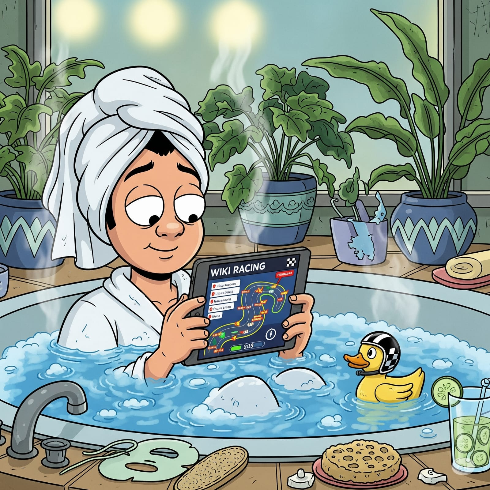

# 
Wiki Racing SPA and API Server

 

## About

The Wiki Racing SPA is a simple single-player implementation of the 
[Wiki Game](https://en.wikipedia.org/wiki/Wikipedia:Wiki_Game) in which a player endeavours to navigate from
a starting Wkipedia page to a goal page by clicking only on wikilinks. The objective is to reach the goal in
the shortest time while clicking on the smallest numbert of wikilinks.

This repository contains multiple implementations of the frontend and backend server. A REST API is exposed by the server, helping to bypass CORS
issues that a SPA experiences in dealing directly with Wikipedia.

## Components

There are two components
- a [Single-Page Application](https://en.wikipedia.org/wiki/Single-page_application) executing in a 
  web browser
- a [REST API server](https://en.wikipedia.org/wiki/REST)

### Frontends (the browser SPA component)

#### Material Tailwind

Implemented in [Gleam](https://gleam.run), leveraging the [Lustre web framework](https://hexdocs.pm/lustre/lustre.html), and built by implementing Lustre versions of [Material Tailwind for HTML](https://www.material-tailwind.com/docs/html/installation).

#### Material 3 Expressive

Implemented in [Gleam](https://gleam.run), leveraging the [Lustre web framework](https://hexdocs.pm/lustre/lustre.html), and built upon the [M3E wrapper](https://github.com/bruceesmith/m3e) for the [Material 3 Expressive](https://matraic.github.io/m3e/#/getting-started/overview.html) HTML components.

### Backends (the API server component)

#### Gleam

The simplicity, elegance, and reliability of my Gleam frontends led me to wonder what a Gleam backed would look like. So I hand-coded one, asked
Gemini to assist with the de-coupling of server and client, with removing the hard-code use of httpc.dispatch, to perform a code review, and to
develop the test suite. I'm very happy with the end result.

#### Go

This is the initial REST server, hand-coded and employing techniques and patterns learned from years of building Docker-hosted Go daemons in a
corporate environment. Code review was performed by Gemini, and after the solid aspects of that review were incorporated, Gemini was used to add test
cases. The server is a small [Go](https://go.dev/) binary that can run on any platform supported by Go (including Windows, Linux, macOS) or hosted on
any Docker platform.

#### Rust

There has been and is so much noise in the systems programming community about Rust that I could not help but wonder what a Rust backend for Wiki
Racing would look like. So, not being Rust-y myself, I asked Gemini to write an idiomatic Rust version of my Go backend; this is the result. I'm glad
I have not learned Rust.

## Building from source

_to be completed_

1. Clone the repository 
  - `git clone https://github.com/bruceesmith/wrspa.git`
  - `cd wrspa`
2. Install Go,  Gleam and Tailwind CSS
3. Build the SPA
  - `cd frontend`
  - `make build-prod`
  - `cd ..`
4. Build the server
  - `cd backend`
  - `make build`
  - `cd ..`

